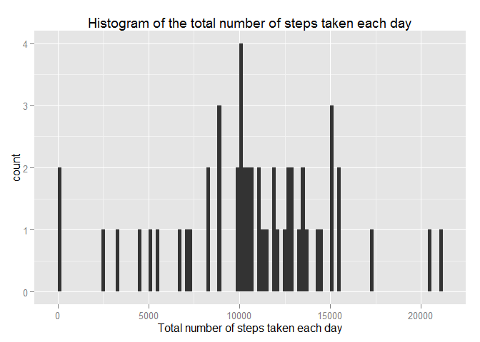
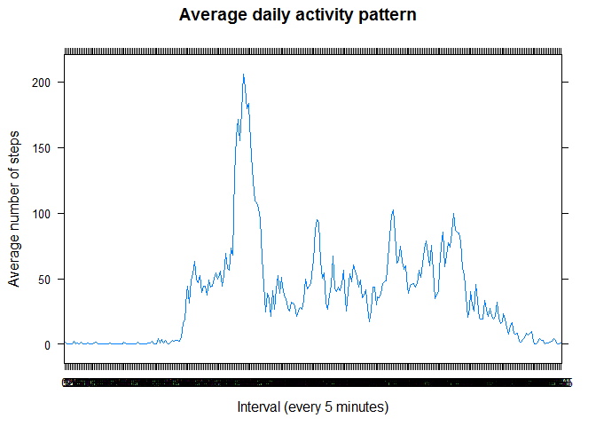
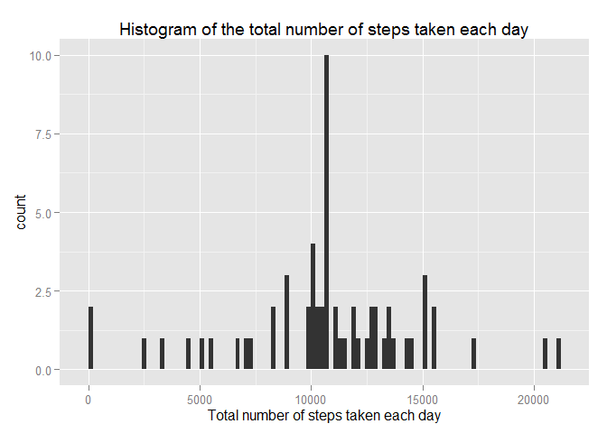
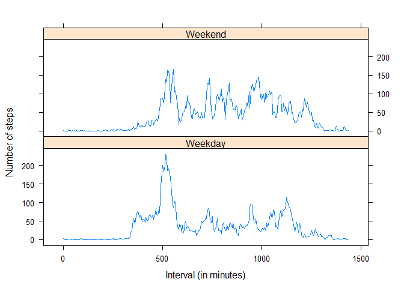

# Reproducible Research: Peer Assessment 1


## Loading and preprocessing the data

```r
file <- "activity.csv"
data_raw <- read.csv(unz("activity.zip",file), na.strings="NA",
                     stringsAsFactors = FALSE)

#converting data column from string to POSIXct
library(lubridate)
library(dplyr)
```

```
## 
## Attaching package: 'dplyr'
## 
## The following objects are masked from 'package:lubridate':
## 
##     intersect, setdiff, union
## 
## The following object is masked from 'package:stats':
## 
##     filter
## 
## The following objects are masked from 'package:base':
## 
##     intersect, setdiff, setequal, union
```

```r
data <- mutate(data_raw, date  = ymd(date))
data <- mutate(data, interval  = as.factor(interval))
```


## What is mean total number of steps taken per day?
Histogram of the total number of steps taken each day is as shown below:

```r
# Make a histogram of the total number of steps taken each day
library(ggplot2)
data_rm <- subset.data.frame(data, !is.na(steps))
step_sum_day <- aggregate(steps ~ date, data=data_rm, FUN=sum)
qplot(steps, data = step_sum_day, binwidth = 200, 
      main = "Histogram of the total number of steps taken each day",
      xlab = "Total number of steps taken each day")
```

 

* The mean of total number of steps taken per day is:

```r
mean(step_sum_day$steps)
```

```
## [1] 10766.19
```
* The median total number of steps taken per day is:

```r
median(step_sum_day$steps)
```

```
## [1] 10765
```

## What is the average daily activity pattern?
A time series plot (i.e. type = "l") of the 5-minute interval (x-axis) and the average number of steps taken, averaged across all days (y-axis) is shown as below:

```r
step_avg_interval <- aggregate(steps ~ interval, data=data_rm, FUN=mean)

library(lattice)


xyplot(steps ~ interval , type = "l" ,data = step_avg_interval,  
       ylab="Average number of steps", xlab = "Interval (every 5 minutes)", 
       main = "Average daily activity pattern")
```

 

On average across all the days in the dataset, this 5-minute interval contains the maximum number of steps:

```r
step_avg_interval$interval[which.max(step_avg_interval$steps)]
```

```
## [1] 835
## 288 Levels: 0 5 10 15 20 25 30 35 40 45 50 55 100 105 110 115 120 ... 2355
```

## Imputing missing values
The total number of missing values in the dataset is:

```r
sum(is.na(data$steps))
```

```
## [1] 2304
```

Here use the mean for that 5-minute interval to fill in all of the missing values in the dataset.

```r
data_filled <- data
for (i in step_avg_interval$interval){
        data_filled[is.na(data$steps) & data$interval == i,"steps"] <- 
                step_avg_interval[ step_avg_interval$interval == i,"steps"]
        
}
```
Histogram of the total number of steps taken each day after missing values imputation:

```r
step_sum_day_filled <- aggregate(steps ~ date, data=data_filled, FUN=sum)
qplot(steps, data = step_sum_day_filled, binwidth = 200, 
      main = "Histogram of the total number of steps taken each day",
      xlab = "Total number of steps taken each day")
```

 

Correspondingly, the mean and median total number of steps taken per day:

```r
mean(step_sum_day_filled$steps)
```

```
## [1] 10766.19
```

```r
median(step_sum_day_filled$steps)
```

```
## [1] 10766.19
```
Imputing missing data does not affect the mean total daily number of steps, while median value slightly increases, by 1.19, which can be ignored.


## Are there differences in activity patterns between weekdays and weekends?

```r
# Create a new factor variable in the dataset with two levels - "weekday" and "weekend" indicating whether a given date is a weekday or weekend day.
Sys.setlocale("LC_TIME","English")
```

```
## [1] "English_United States.1252"
```

```r
data_filled <- mutate(data_filled, dayofweek = weekdays(date))
data_filled$dayofweek <- as.factor(ifelse(data_filled$dayofweek
                                 %in% c("Saturday","Sunday"), "Weekend", "Weekday"))
```
A panel plot containing a time series plot (i.e. type = "l") of the 5-minute interval (x-axis) and the average number of steps taken, averaged across all weekday days or weekend days (y-axis) is displayed below:

```r
step_avg_week <- aggregate(steps ~ interval*dayofweek, data=data_filled, FUN=mean)
step_avg_week["interval"] <- lapply(step_avg_week["interval"],  as.character) 
step_avg_week["interval"] <- lapply(step_avg_week["interval"],  as.integer) 
step_avg_week["interval"] <- lapply(step_avg_week["interval"], function(x) x%/%100*60+x%%100)

xyplot(steps ~ interval | dayofweek, type = "l" ,data = step_avg_week, 
       layout = c(1, 2), ylab="Number of steps", xlab = "Interval (in minutes)") ## Plot with 2 panels
```

 

Differences include:

* There are more activities in early morning in weekday than weekend, as people need to go to work at that time.

* There are less activities during daytime in weekday than weekend, as people are  probably working in that period.

* The activity pattern in weekend is relatively homogeneous, compared to the two sharp peaks in weekday.
